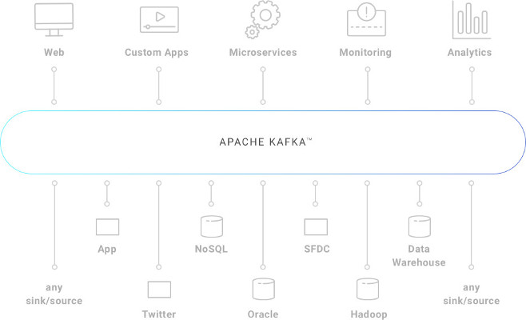

# Apache Kafka

### A distributed streaming platform

---
### Why?

> Kafka® is used for building real-time data pipelines and streaming apps. It is **horizontally scalable**, **fault-tolerant**, **wicked fast**, and runs in production in thousands of companies.

+++  

### Where?  

  
  
-> [available Kafka Clients](https://cwiki.apache.org/confluence/display/KAFKA/Clients)

+++  

### What for?  
* messaging system  
 (pub/sub & queue messaging)
* stream processing
* store streams of data safely in a distributed, replicated, fault tolerant cluster

---

### Overview

+++  
@title[architecture]  

+++  
### Cluster
* multiple brokers
* horizontal scale out without downtime 
* manage the persistence and replication of message data

+++  
### Broker
* a Kafka cluster typically consists of multiple brokers to maintain load balance
* brokers are stateless (ZooKeeper for maintaining cluster state)
* a broker instance can handle hundreds of thousands of reads&writes per second
* each broker can handle TB of messages without performance impact
* leader election by ZooKeeper

+++  
### Topic

* each partition contains messages in an immutable ordered sequence  
* each partition is consumed by exactly one consumer in the group

+++  
### Producer
* publish messages to one or more Kafka topics
* send data to Kafka brokers
* the broker appends the message to the last segment file.  

+++  

### Consumer
* read data from brokers
* subscribe to one or more topics
* consume published messages by pulling data from the brokers
* manages the offset (index from which one wants to read from)  

---
### Ecosystem

+++  

+++  
### Kafka Connect
* easy to add new systems to your existing data pipelines
* move large collections of data into and out of Kafka
* [Connectors](https://www.confluent.io/product/connectors)

+++  
### Kafka Streams  
* enable real-time processing of streams
* stateless stream processing
* local storage in streams
* stateful aggregations,filtering,transformations
* small lightweight microservices instead of batch processing at big data clusters

+++   
### KSQL - Streaming SQL Engine
* use SQL on top of Kafka Streams for processing streams
* sliding windows, windowing functions

---
### Use Cases

+++  
### Messaging
Kafka works well as a replacement for a more traditional message broker.   

+++  
### Real-Time Feeds
Kafka can be used to for creating an activity tracking pipeline as a set of real-time publish-subscribe feeds  

+++  
### Event Sourcing
Kafka's support for very large stored log data makes it an excellent backend for an application built with Event Sourcing  

+++  
### Commit Log  

With a commit log one can replicate data between nodes and acts as a re-syncing mechanism for failed nodes to restore their data.  

---
### Examples from justGo backend

* data migration from v1 to v2
  * new v2 service can read all input-data from the topic again, stores data in its new format

+++  

* events
  * multiple microservices read event topics at different times during our processing

+++  
 
* fallback
  * persistent Dead-Letter Queue

+++  

* bug-fixing
  * simply re-read the whole topic after fixing a bug which affected massage processing

---  

## Wrap Up I
* performance !!!
  * handle a large number of diverse consumers
  * stable performance even with TB of messages
  * high throughput for both publishing & subscribing  

+++  
## Wrap Up II
* scalable, fault-tolerant, persistent, distributed storage
  * immediately written to disk
  * replicated
  * strong ordering guarantees
  * configurable retention period

+++  
## Wrap Up III
* flexible consuming
  * consumer manages offset(re-consume old messages)
  * load balanced dynamically with consumer-groups  